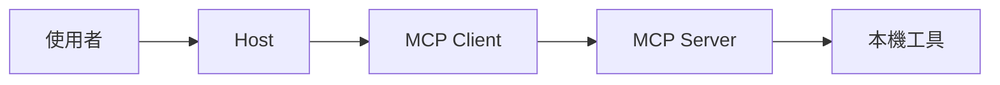

## 學習目的

這份示例以虛構的本機筆記工具說明 MCP。它不連接任何實際服務，也不包含真實使用者資料。

## 核心概念

MCP 將用戶端、協定與伺服器之間的界面標準化。模型可以透過受控工具取得資料或執行明確操作，宿主仍負責權限與使用者確認。

## 訊息流程

```mermaid
flowchart LR
  User[使用者] --> Host[Host]
  Host --> Client[MCP Client]
  Client --> Server[MCP Server]
  Server --> Tool[本機工具]
```

## 實作提醒

先定義工具輸入、輸出與錯誤，再決定要不要提供寫入能力。每個工具都應採用最小權限。
